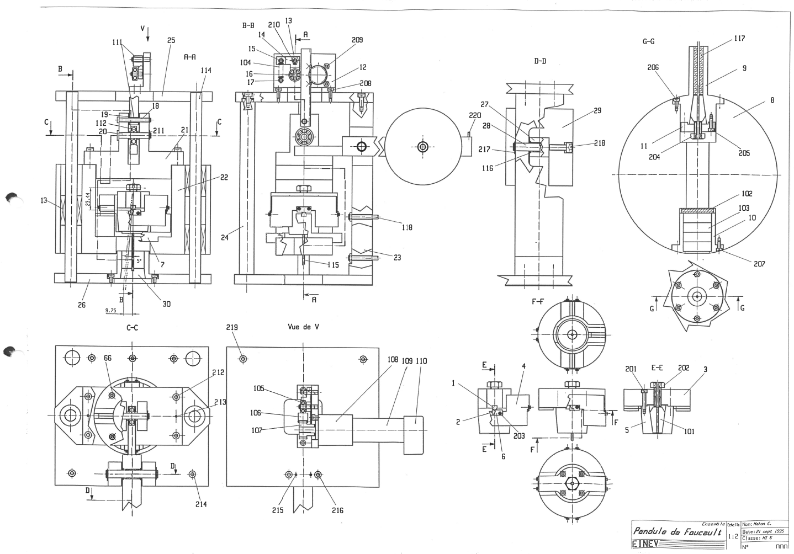

# Le pendule de la HEIG-VD

En 1995 naît dans l'esprit de nos professeurs l'ambitieux projet de réaliser un pendule de Foucault à la HEIG-VD (alors nommée l'EINEV). Installé dans le puis de lumière du bâtiment principal, cela fait maintenant plus de 25 ans que le pendule de Foucault oscille de manière permanente.

Par sa présence, il anime le hall de l'école et suggère quelques interrogations dans l'esprit des étudiants au sujet de la physique et du mouvement de la Terre.

Le professeur Éric Lambert a été le principal instigateur de ce projet suivi  ensuite par le professeur Freddy Mudry qui a oeuvré plus d'une trentaine d'années dans l'école. Il a travaillé étroitement avec les professeurs Éric Lambert et Georges Derron pour établir les équations du mouvement du pendule et les conditions d'entretien de l'oscillation.

Plusieurs travaux d'étudiants ont été réalisés sur le pendule de la HEIG-VD :

- **C. Mahon (1995)** Conception du pendule de Foucault de l'EINEV.
- **Pascal Neuwerth (1995)** Commande, acquisition et affichage des données d'un pendule de Foucault
  - Réalisation d'une électronique de suivi de l'oscillation du pendule et de synchronisation du mouvement d'entretien
  - Commande du moteur d'entretien par ordinateur.
- **Diego Gonzalez (1998)** Entretien et contrôle du mouvement d'un pendule de Foucault à l'aide d'un microcontrôleur
- **Vincent Mack (2000)** Commande d'un pendule de Foucault à l'aide d'un microcontrôleur.
  - Installation d'une liaison infrarouge pour la transmission du signal du détecteur de passage entre le bas et le haut du pendule.
  - Programmation du microcontrôleur.
- **Daniel Greco (2004)** Remise en service du système
- **Patrick Schletti (2011)** Conception d'un système de mesure et d'analyse de la vitesse de précession d'un pendule de Foucault.
- **Yoann Jossevel (2014)** Système d'entreien des oscillations d'un pendule de Foucault
- **A. Cardinale (2023)** Pendule de Foucault de 20 mètres à la HEIG-VD
  - Perfectionnement de l'entretien par moteurs linéaires direct drive.
  - Acquisition de la position par caméra infrarouge.
  - Commande en temps réel du mouvement d'entretien et asservissement de l'amplitude d'oscillation.
  - Interface graphique de contrôle et de visualisation des données.

## Entretien du pendule <!-- {docsify-ignore} -->

Un pendule qui ne serait qu'une simple masse suspendue à un fil n'oscillerait que durant quelques heures avant de s'arrêter. Pour maintenir les oscillations du pendule de Foucault, il convient d'induire une force d'entretien qui maintient une amplitude d'oscillation constante.

La communauté scientifique connaît deux méthodes pour entretenir les oscillations du pendule de Foucault. La première méthode consiste à placer sous la masse du pendule un électroaimant qui attire la masse à chaque passage. La seconde plus délicate consiste à lever légèrement la masse du pendule à chaque passage en hissant le point d'attache situé en contrehaut.

La première méthode présente l'inconvénient d'induire un mouvement parasite qui, s'il n'est pas compensé génère une éllipiticé de l'oscillation. Un dispositif mécanique nommé anneau de Charon est alors utilisé pour compenser ce mouvement parasite.

Néanmoins, c'est la seconde méthode qui a été retenue pour l'entretien du pendule de la HEIG-VD. Historiquement une crémaillère couplée à un moteur DC a été utilisée pour lever la masse du pendule à chaque passage. Pour soulager le moteur, un contrepoids fut utilisé pour compenser la masse du pendule.

On peut montrer que l'équation du mouvement d'un pendule est amorti par un frottement de type visqieux :

$$
F_f = -c_f v
$$

L'équation de mouvement du pendule s'écrit alors :

$$
\ddot{\theta} + 2\gamma \dot{\theta} + \omega_0^2 \left[
    1 - \alpha \left(\frac{\omega_e}{\omega_0}\right)^2 \cos(\omega_e t) -
    2\frac{\gamma}{\omega_0} \alpha \frac{\omega_e}{\omega_o} \sin(\omega_e t)
\right] \sin \theta = 0
$$

où :

- $\alpha = s_0 / L$ est le rapport entre la distance de levage et la longueur du fil
- $\gamma = c_f / 2m$ est le coefficient d'amortissement
- $\omega_0 = \sqrt{g / L}$ est la pulsation propre du pendule

En supposant un amortissement faible ($\gamma \ll \omega_0$), une légère excitation ($\alpha \ll 1$) et de petites oscillations ($\sin \theta \approx \theta$), on peut simplifier l'équation du mouvement :

$$
\ddot{\theta} + 2\gamma \dot{\theta} + \omega_0^2 \left[
    1 - \alpha \left(\frac{\omega_e}{\omega_0}\right)^2 \cos(\omega_e t)
    \right] \theta = 0
$$

En l'absence d'amortissement, l'équation ci-dessus devient l'équation de Mathieu:

$$
\ddot{\theta} + \omega_0^2 \left[
    1 - \alpha \left(\frac{\omega_e}{\omega_0}\right)^2 \cos(\omega_e t)
    \right] \theta = 0
$$

Cette équation abondamment étudiée dans la littérature possède des solutions de différents types. En particulier, on peut montrer que pour certaines valeurs de $\omega_e$ et $\alpha$, l'amplitude des oscillations du pendule peut croître de manière exponentielle. C'est ce qu'on appelle l'effet de résonance. Hors de ces domaines de résonance, l'amplitude des oscillations la solution est stable, donc temporellement décroissante et pratiquement inintéressante ici.

Pratiquement afin de profiter au maximum de l'amplification paramétrique et limiter l'aspect généralement chaotique du mouvement qu'elle engendre, on asserit la pulsation de l'excitation à celle du pendule en prenant :

$$
\omega_e = 2\omega_0
$$

et on choisira :

$$
\alpha = \frac{s_0}{L} > \frac{\gamma}{\omega_0}
$$

## Spécification du pendule de la HEIG-VD <!-- {docsify-ignore} -->

| Paramètre | Valeur |
|-----------|--------|
| Longueur du fil | 20 m |
| Masse de la boule | 19.5 kg |
| Masse du contrepoids | 4 kg |
| Diamètre du fil | 1 mm |
| Latitude | 46°50' |
| Précession angulaire | 10.96°/h |
| Révolution | 36 h |

La pulsation propre du pendule est donnée par :

$$
\omega_0 = \sqrt{\frac{g}{L}} = 0.7 \text{Hz}
$$

Avec une période de :

$$
T_0 = \frac{2\pi}{\omega_0} = 9 \text{s}
$$

La précession du pendule est donnée par :

$$
\Omega_F = \Omega_T \sin\theta_L = 10.96 \text{deg/h}
$$

## Quelques photos <!-- {docsify-ignore} -->

Design mécanique initial établi par C. Mahon en 1995 :

