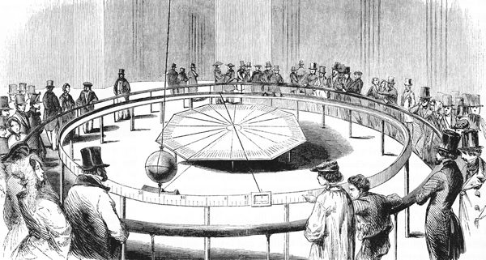

# Le Pendule de Foucault

> Venez voir tourner la Terre, venez la voir jeudi au Panthéon ! - Léon Foucault

C'est avec ces mots que le physicien Léon Foucault en 1851 a invité le public à venir observer son expérience au Panthéon de Paris. Cette expérience a permis de mettre en évidence la rotation de la Terre. Depuis, de nombreux pendules de Foucault ont été installés dans le monde entier.

Connu pour ses travaux scientifiques, Louis Napoléon Bonaparte demande à Léon Foucault de réaliser l'expérience au Panthéon de Paris. Le pendule est composé d'une boule de laiton et d'acier de 28 kg, d'un diamètre de 17 cm et d'un fil de 67 m de long.

## Principe <!-- {docsify-ignore} -->

Un pendule de Foucault est un dispositif expérimental permettant de mettre en évidence la rotation de la Terre. Il est constitué d'un fil de grande longueur, sur lequel est suspendue une masse. Le fil est fixé à un point fixe, et la masse est mise en mouvement. La rotation de la Terre va faire tourner le plan d'oscillation du pendule, et la direction de la rotation du plan d'oscillation est déterminée par la latitude du lieu où se trouve le pendule.

Ci-dessous, une photo du pendule de Foucault du Panthéon de Paris.

Sur cette illustration, on observe l'effet de précession du pendule de Foucault. Ici les oscillations et la rotation de la terre sont considérablement amplifiées pour une meilleure visualisation.

## Historique <!-- {docsify-ignore} -->

La première expérience du pendule de Foucault a été réalisée par Léon Foucault en 1851. Il a réalisé cette expérience pour la première fois au Panthéon de Paris. Depuis, de nombreux pendules de Foucault ont été installés dans le monde entier.

Il ne semblerait pas que Léon Foucault ait été informé des travaux de Gaspard-Gustave Coriolis portant sur les lois de la dynamique dans un référentiel non inertiel. Ces travaux ont été publiés en 1835, soit 16 ans avant l'expérience du pendule de Foucault. L'expérience du Panthéon a été réalisée de manière purement empirique, même si elle peut être expliquée par l'utilisation de la force de Coriolis.

## Équation du mouvement <!-- {docsify-ignore} -->

Sans tenir compte de la rotation de la Terre par rapport à un référentiel galiléen et dans le cas de petites oscillations, on peut écrire l'équation du mouvement du pendule de Foucault sous la forme d'un pendule simple:

où 
 est la pulsation propre du pendule exprimée comme :

avec  l'accélération de la pesanteur et  la longueur du fil. On observe donc que la masse du pendule n'influence pas la période d'oscillation.

Une solution de ce système d'équations pour l'instant initial , lorsque le pendule passe en ) avec une vitesse  est donnée par :

%5C%5Cy=0%5Cend%7Barray%7D%5Cright.%0A)

Si l'in intègre la rotation de la Terre par rapport à un référentiel galiléen, il faut tenir compte des forces induites par la rotation de la Terre. Parmis ces dernières, l'accélération de Coriolis qui s'écrit :

)

où  est la vitesse du pendule par rapport à la Terre, et  est le vecteur unitaire porté par l'axe de rotation terrestre. Quant à , il représente la vitesse de rotation angulaire de la Terre (à savoir un tour en un jour sidéral).

Un jour sidéral est égal à  secondes, soit une journée sidérale de  heures,  minutes et  secondes.

En utilisant la notation complexe 
, on peut réécrire l'équation du mouvement du pendule de Foucault en intégrant la force de Coriolis :

=\exp^{-i\Omega\sin(\theta t)}\left[z_0\left(\cos(\omega_0t)+i\frac{\Omega\sin\theta}{\omega_0}\sin(\omega_0t)\right)+\frac{\dot{z_0}}{\omega_0}\sin(\omega_0t)\right])

Ainsi, si la vitesse initiale  est nulle, le pendule de Foucault oscille en un plan fixe. Si la vitesse initiale est non nulle, le plan d'oscillation du pendule tourne à une vitesse angulaire ).

## Un pendule fixe, mais par rapport à quel système de référence ? <!-- {docsify-ignore} -->

Le pendule de Foucault pose la question de la nature du repère qui sert de référence. En effet, tout mouvement est relatif. Si la Terre est en rotation, elle l'est par rapport à quelque chose ; on ne peut pas parler d'un mouvement sans définir un cadre de référence. Dans la physique classique non-relativiste, donc avec métrisation euclidienne (voir l'équation ci-dessus), on fait l'hypothèse que le pendule oscille dans un plan fixe dans le référentiel galiléen (inertiel pour ce qui concerne les rotations).

Les mesures montrent que les étoiles distantes semblent former, en première approximation, un référentiel par rapport auquel le plan d'oscillation du pendule paraît être fixe, donc, en première approximation, le repère galiléen peut être lié aux étoiles distantes, et donc, dans l'équation précédente, la Terre tourne autour de son axe avec , égale à la vitesse de rotation sidérale.

Mais comment est défini exactement ce référentiel ? Qu'a-t-il de particulier pour que le pendule reste fixe par rapport à celui-ci et pas un autre ? Cette question reste toujours sujette à controverse12.

Cette question ne posait pas de problème fondamental au temps de Foucault, car il était généralement admis à cette époque qu'il existait un espace absolu, tel que l'avait postulé Newton dans ses Principia Mathematica, par rapport auquel tous les mouvements sont définis, et qui forme donc un référentiel naturel d'oscillation du pendule.

## Un pendule, un système très sensible aux effets parasites <!-- {docsify-ignore} -->

La mise en évidence de la rotation terrestre par le pendule de Foucault est une expérience très délicate. Le plan d'oscillation du pendule tourne de quelques degrés par heure (maximum, 15° aux pôles). Plusieurs phénomènes risquent de masquer ce que l'on veut mettre en évidence.

- L'amortissement du pendule par le frottement dans l'air : il est proportionnel à la section du pendule, à son volume, et inversement proportionnel à son poids. On choisira donc un objet dense et lourd. Il faut une sphéricité parfaite, un cylindre est parfois plus approprié pour de petites amplitudes.
- L'asymétrie du pendule. Celui-ci doit être parfaitement symétrique pour ne pas dévier. Il ne doit pas non plus pivoter sur lui-même : l'effet Magnus le dévierait de son plan d'oscillation (cependant, il tournera légèrement sur lui-même en raison de sa précession). Il faut aussi veiller au point d'attache.